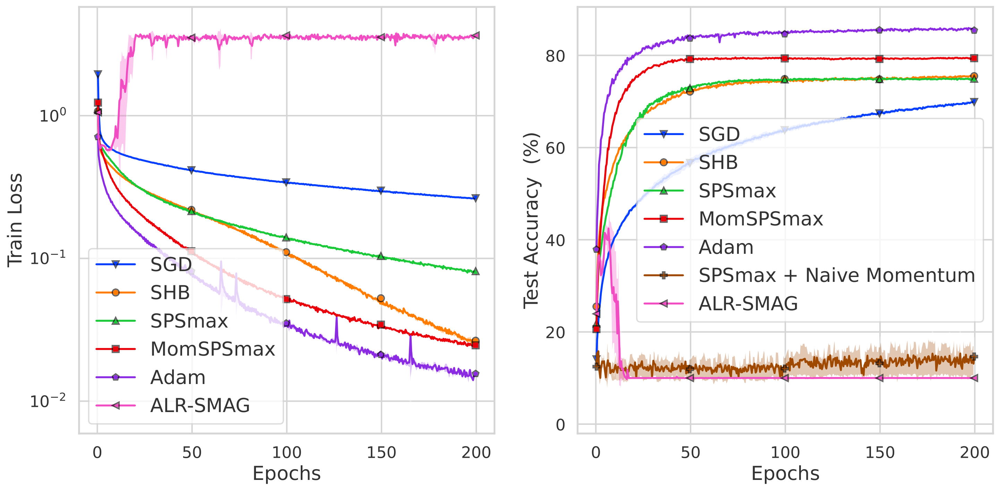
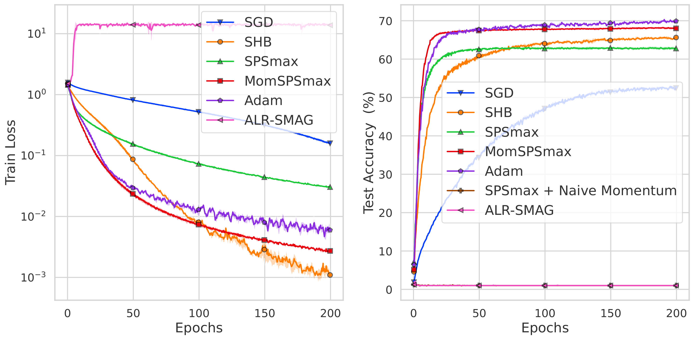

# MomSPS
This is the official repository for the code used to run the experiments in the paper that proposed the MomSPS optimizer. The optimizer is implemented in PyTorch. 


**Stochastic Polyak Step-sizes and Momentum: Convergence Guarantees and Practical Performance**\
*D. Oikonomou, N. Loizou*\
Paper: https://arxiv.org/abs/2406.04142


## Installation

You can install the package with

```
pip install momsps
```


## Usage

Import the optimizers (with their default hyper-parameters) in Python with

``` python
from momsps import MomSPS
opt = MomSPS(model.parameters())
```
or

``` python
from momsps import MomSPS_smooth
opt = MomSPS_smooth(model.parameters())
```

**Important: you only need to adapt one line of your training script, described below.** 
MomSPS needs access to the value of the (mini-batch) loss in the ``.step()`` method. The easiest way to do this is

``` python
loss = YOUR_LOSS_FUNCTION()
loss.backward()
opt.step(loss=loss)           # the line you need to change
```


## Examples

For a complete description of our experiments, please see the paper. In the left plot we plot the training loss and in the right plot we plot the test accuracy.

### ResNet34 for CIFAR10

<p float="left">
    
</p>

### ResNet34 for CIFAR100

<p float="left">
    
</p>


## Citation

If you find our work useful, please consider citing our paper.

```
@article{oikonomou2024stochastic,
  title={Stochastic Polyak Step-sizes and Momentum: Convergence Guarantees and Practical Performance},
  author={Oikonomou, Dimitris and Loizou, Nicolas},
  journal={arXiv preprint arXiv:2406.04142},
  year={2024}
}
```
